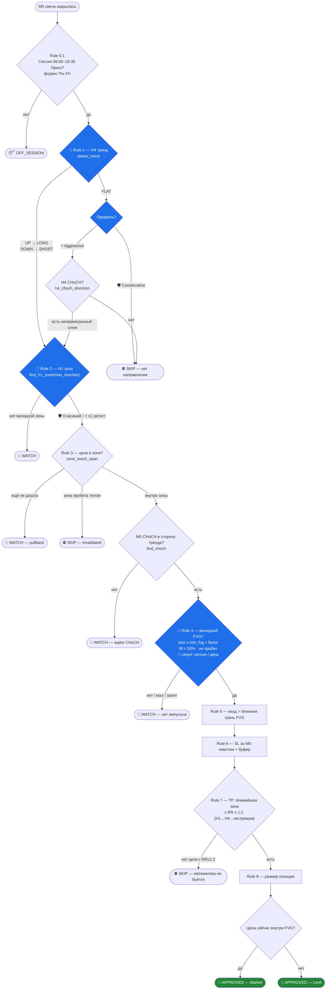
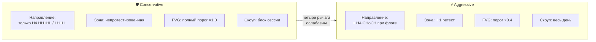

# Стратегии: Консервативная vs Агрессивная

> ⚠️ **Документ от 2026-07-25 — исторический.** С тех пор правила менялись
> решениями владельца, и этот текст их не отражает: RR-гейт снят
> (детектор-режим 2026-08-06 — `SMC_MIN_RR` 1:1 только помечает алерт ⚠️),
> стоп стоит за свипнутым экстремумом, а не за M5-пивотом (2026-08-05), при
> флэте H4 направление берётся с H1, а при флэте обоих торгуется диапазон
> (D11), зона интереса — ордер-блок или нетронутый H1-имбаланс (D4),
> M5-имбаланс — метка и условие ⭐, а не гейт (D22), контр-H4 сетап
> показывается без звезды (D23), команда `/strategy` снята (2026-08-12) — все
> пары идут на профиле `SMC_DEFAULT_PROFILE`. Актуальная истина — `CLAUDE.md`;
> здесь остаётся верной только механика профилей (§1, §4).

Наглядный разбор того, как бот считает сетапы по паре, и чем два профиля
отличаются. Базовая стратегия одна — **Triple Sync + Imbalance**
(H4 тренд → H1 зона → M5 CHoCH + FVG, RR ≥ 1:2). Профиль не меняет правила —
он **масштабирует строгость** ровно в четырёх точках воронки.

> Профиль переключается по паре командой **`/strategy`** (или «всем сразу»).
> По умолчанию все пары на 🛡 **Conservative** — деплой ничего не меняет,
> пока не нажмёшь кнопку. Дефолт задаётся `SMC_DEFAULT_PROFILE`.

---

## 1. Два профиля в одном взгляде

| Что | 🛡 Conservative | ⚡ Aggressive | Где в коде |
|---|---|---|---|
| **Направление** (Rule 1) | только подтверждённый H4-тренд (HH+HL / LH+LL); флэт → SKIP | флэт → берём направление от **H4 CHoCH** (слом последнего пивота, не переигранный) | `allow_h4_choch_entry` |
| **Размер FVG** (Rule 4) | полный порог пары (×1.0) | порог **×0.4** (ETH $2→$0.8, форекс 5→2 пипса) | `fvg_size_factor` |
| **Зона H1** (Rule 2) | только **непротестированная** (0 касаний) | допускается **1 ретест** | `max_zone_touches` |
| **Скоуп FVG** (Rule 4) | внутри блока сессии (London/NY раздельно) | весь торговый день Праги | `fvg_day_scope` |

Всё остальное **идентично** в обоих профилях: сессии 08:00–18:30 Прага, min RR 1:2,
стоп за M5-пивотом, новостной блэкаут −60/+15, дисциплина (Rule 0.2 / Rule 10),
размер позиции. Консерватив — это агрессив со всеми четырьмя рычагами в
нейтральном положении.

---

## 2. Как это считается — воронка правил

Свеча M5 закрылась → бот прогоняет по паре весь чек-лист сверху вниз. На любом
шаге сетап может умереть (⛔/👀). До 🚨 доходит только то, что прошло всё.
🔷 — точки, где профиль меняет поведение.

Крипта (ETHUSD) торгуется 24/7 и всегда использует дневной скоуп FVG — у неё
нет разрыва ликвидности London/NY, поэтому этот рычаг для неё нейтрален в обоих
профилях.

---

## 3. Детальный разбор каждого правила

### Rule 0.1 — Сессия
Входы только в торговом окне **08:00–18:30 Прага**, разбитом на два блока:
Frankfurt/London (08:00–14:00) и New York (14:00–18:30). Вечерний хвост
18:30–20:00 отключён решением владельца 2026-08-07: сетапов там не было, а
лимит Twelve Data он съедал. Крипта каждый день, форекс —
только Пн–Пт. Свежесть данных проверяется отдельно: если последняя M5-свеча
старше 30 минут — рынок считается закрытым (выходные форекса). *Одинаково в
обоих профилях.*

### Rule 1 — H4 тренд 🔷
`detect_trend` находит фрактальные пивоты (крыло 2 свечи + 2 закрытых тела на
подтверждение) и смотрит на два последних максимума и минимума:
- **HH + HL** → аптренд → ищем **LONG**
- **LH + LL** → даунтренд → ищем **SHORT**
- иначе → **FLAT**

Переигранный ложный пробой (fakeout, который цена вернула обратно) тренд не
убивает; непереигранный слом последнего HL/LH — убивает (даунгрейд во FLAT).

**Точка расхождения профилей:**
- 🛡 **Conservative:** FLAT → сразу `SKIP` («нет направления»). Ждём чистой
  структуры — это первая и главная причина, почему консерватив молчит в
  боковике.
- ⚡ **Aggressive:** при FLAT спрашивает `h4_choch_direction` — есть ли
  **непереигранный слом** последнего пивота вниз (→SHORT) или вверх (→LONG).
  Если есть — берём это направление и ловим **первую ногу** движения. Если
  тоже нет — `SKIP`.

### Rule 2 — H1 зона 🔷
`find_h1_zone` берёт последнюю валидную зону Demand (для LONG) / Supply
(для SHORT). Зона строится по свече-пивоту: от фитиля до тела. Зона считается
**invalidated**, если тело свечи закрылось за её дальней гранью.

**Точка расхождения:**
- 🛡 `max_touches = 0` — только **непротестированная** зона (свежая).
- ⚡ `max_touches = 1` — допускается зона с **одним завершённым ретестом**.
  В боковике непротестированных зон часто нет вообще — это второй рычаг
  участия.

### Rule 3 — Касание зоны + M5 CHoCH
`zone_touch_span` находит **начало последнего непрерывного захода** цены в зону
(а не последнюю свечу — это был баг, из-за которого триггер был невидим, пока
цена сидела в зоне; исправлено в обоих профилях). Заходом считаются только
свечи, которые появились **после того, как зона сформировалась**, и реально
торговались **внутри** полосы — касание грани заходом не считается. Иначе
свежий H1-имбаланс читался бы как «цена уже в зоне» с момента своего рождения:
полосу разрыва цена только что прошла, а импульсная свеча стоит ровно на её
грани. От этого начала `find_choch`
ищет **Change of Character** — первую свечу, чьё тело закрывается за последним
противоположным M5-пивотом (для LONG — выше последнего lower-high). *Логика
одинакова в обоих профилях; профиль лишь влияет на то, какая зона сюда дошла.*

### Rule 4 — Валидный FVG 🔷🔷
FVG (Fair Value Gap) — 3-свечной разрыв на M5: для LONG `low(новой) > high(старой)`.
Проверки:
1. **Размер** ≥ `min_fvg × fvg_size_factor` 🔷
2. **Заполнение** < 50% (не залит откатом)
3. **Не пробит** телом насквозь
4. **Скоуп** 🔷: свежесть в рамках сессии или дня

**Две точки расхождения:**
- **Размер** 🔷: 🛡 ×1.0 (полный порог) vs ⚡ ×0.4. Для форекса это решает
  — M5-гэпы там мелкие относительно 5-пипсового порога (см. §6 калибровку).
- **Скоуп** 🔷: 🛡 FVG действителен только внутри своего блока сессии
  (лондонский не переносится в NY) vs ⚡ весь торговый день Праги.

### Rule 5–8 — Геометрия сделки *(одинаково в обоих профилях)*
- **5. Вход** = ближняя грань FVG (top для LONG, bottom для SHORT).
- **6. SL** = за последним подтверждённым M5-пивотом ± буфер пары.
- **7. TP** = перебор непротестированных противоположных зон наружу
  (сначала H1, потом H4, затем структурный экстремум H4) — берём **первую с
  RR ≥ 1:2**. Нет такой → `SKIP`. Это защищает от сделок вроде RR 1:0.1.
- **8. Размер позиции** — из депозита × риск% / расстояние до SL (если задан
  `SMC_DEPOSIT`).

### Rule 9 / 0.2 / 10 — Риск и дисциплина *(одинаково)*
- **9.2 Корреляции:** запрет одновременных EURUSD+GBPUSD в одну сторону и
  тройной ставки на USD.
- **9.3 Funding** (только крипта): предупреждение при высокой ставке.
- **0.2:** два взятых стопа за день закрывают торговый день.
- **10:** нет ре-входа после взятого стопа в той же сессии.
- **Новости:** блэкаут −60 / +15 минут вокруг красных новостей Forex Factory.

**Вердикт:** 🚨 `APPROVED_MARKET` если цена уже внутри FVG, иначе
`APPROVED_LIMIT` (лимитка живёт до конца сессии).

---

## 4. Где именно расходятся профили — с числами по парам

`fvg_size_factor` умножает **собственный** минимум пары (он живёт в
`instruments.py` и в обоих профилях один). Эффективный порог FVG:

| Пара | Базовый min FVG | 🛡 ×1.0 | ⚡ ×0.4 | SL-буфер | Источник |
|---|---|---|---|---|---|
| ETHUSD | $2.00 | $2.00 | **$0.80** | $2.00 | Binance |
| USDJPY | 5 пипсов (0.050) | 5.0 п | **2.0 п** | 1.5 п | TwelveData |
| EURUSD | 5 пипсов (0.00050) | 5.0 п | **2.0 п** | 1.5 п | TwelveData |
| GBPUSD | 5 пипсов (0.00050) | 5.0 п | **2.0 п** | 1.5 п | TwelveData |
| USDCAD | 5 пипсов (0.00050) | 5.0 п | **2.0 п** | 1.5 п | TwelveData |

---

## 5. Калибровка — реальные цифры

Замер оффлайн-скриптом `scripts/funnel.py` (глубокий реплей истории M5,
point-in-time, счёт **уникальных** сетапов). Метрика — **сетапов в неделю**.

### ETHUSD (глубина ~45 дней, ~13k M5-свечей)

| Профиль / фактор | сетапов/нед |
|---|---|
| 🛡 Conservative | ~1.0 |
| ⚡ 0.4 | ~5.5 |
| ⚡ 0.6 | ~4.9 |
| ⚡ 0.8 | ~4.3 |
| ⚡ 1.0 | ~3.9 |

### Форекс (глубина ~21 день, TwelveData нативный H4)

| Пара | 🛡 Conservative | ⚡ 0.4 | ⚡ 0.6 |
|---|---|---|---|
| USDJPY | 0 | 1.4 | 0.8 |
| GBPUSD | 0 | 2.5 | 1.4 |
| USDCAD | 0 | 1.9 | 1.1 |
| EURUSD | 0 | 0 | 0 |

**Выводы калибровки:**
1. **Консерватив даёт ~0 сетапов/неделю на КАЖДОЙ форекс-паре** и ~1 на ETHUSD
   — фундаментальная причина недель тишины по форексу (помимо того, что данные
   Yahoo ложно показывали форекс «флэт»; лечится источником TwelveData).
2. **Основной прирост даёт не размер FVG, а структурные рычаги.** H4-CHoCH-вход
   роняет смерти «нет направления» (`h4_flat`) примерно вдвое.
3. **Форекс очень чувствителен к `fvg_size_factor`, крипта — почти нет.** На ETH
   0.4→1.0 меняет частоту слабо (5.5→3.9), на форексе 0.6 уже душит участие.
   Поэтому выбран **глобальный фактор 0.4**.
4. **Важно:** funnel меряет **частоту, а не винрейт.** 0.4 на форексе пропускает
   2-пипсовые FVG — мелкая зона. Стоит ли их брать — решается по `/stats` на
   живой торговле (винрейт по реально взятым сделкам).

> Перекалибровать: `python -m scripts.funnel --all --days 21`
> (или `--pair USDJPY --factors 0.4,0.6,0.8`). Для форекса нужен
> `SMC_FOREX_SOURCE=twelvedata` и ключ.

---

## 6. Как пользоваться

1. **`/strategy`** — кнопки: переключить профиль по каждой паре, либо
   «🛡 All conservative» / «⚡ All aggressive». Смена профиля сбрасывает дедуп
   пары, чтобы первый сигнал нового профиля не был заглушён.
2. **`/status`** — показывает текущий профиль каждой пары.
3. **`/stats`** — винрейт: отдельно по всем сигналам и по реально взятым
   (кнопка ✅ Took it). Тег ⚡ в алерте помечает агрессивные сетапы.
4. `SMC_DEFAULT_PROFILE` (по умолчанию `conservative`) — профиль для пары без
   явного выбора.

**Практика:** консерватив — для качества и тишины (крипта, трендовые дни);
агрессив — для участия в боковике и на форексе, где консерватив молчит.
Дисциплина, сессии, новости и min RR 1:2 работают в обоих одинаково.
